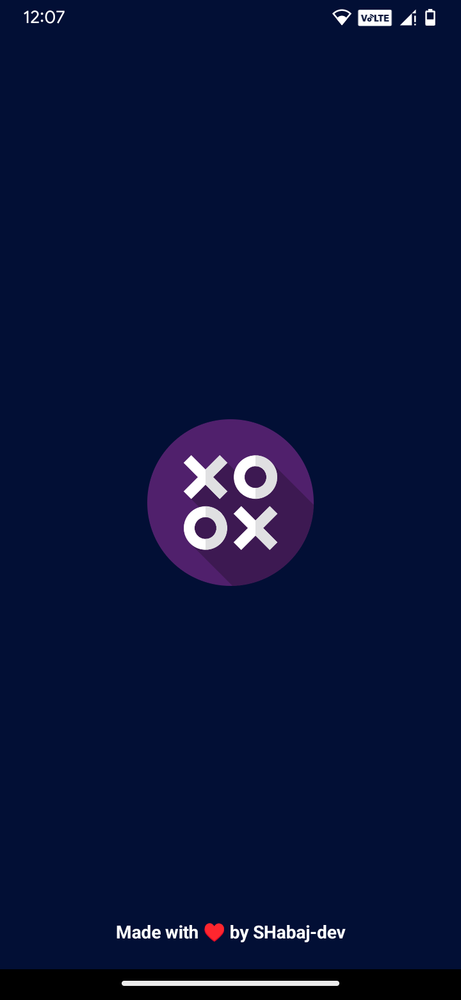
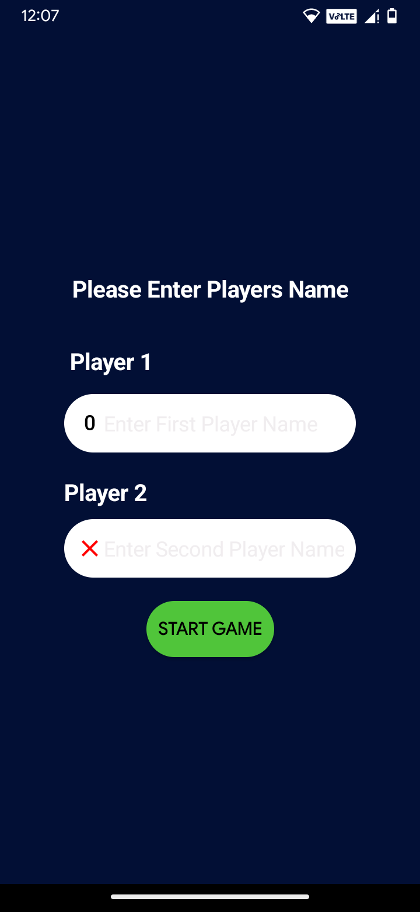
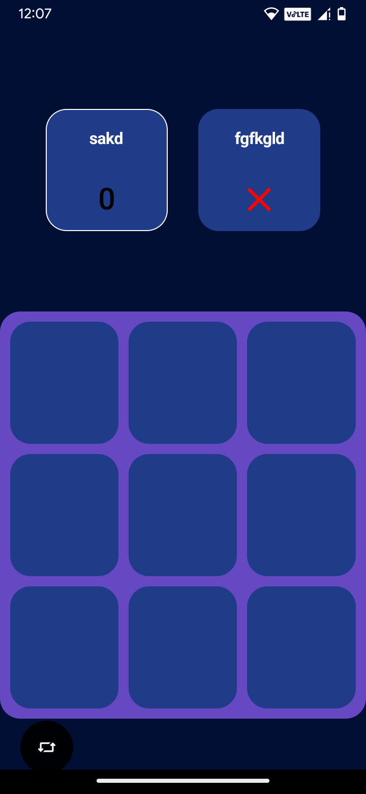
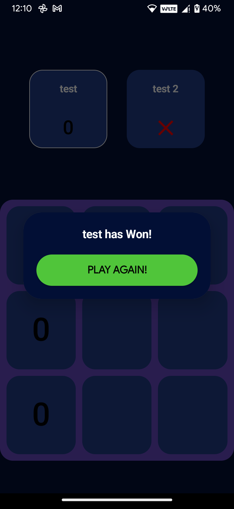

Sure! Here's an example of a `README.md` file for a Tic Tac Toe Android game:

# Tic Tac Toe Android Game

This is a simple Tic Tac Toe game for Android devices. It allows two players to play the classic
game on their mobile devices.

[click here](https://github.com/SHabaj-dev/Tic-Tac-Toe/blob/main/Tic-Tac-Toe.apk) to try!

## Features

- Two-player gameplay: Play against a friend or family member on the same device.
- Interactive UI: Tap on the game board to place X or O symbols.
- Win detection: The game automatically detects when a player wins or if it's a draw.
- Play again: After the game ends, players can choose to play again with a single tap.

## Screenshots

<!-- Screenshots -->
<div style="display: flex; justify-content: space-between;">
  
  
  
  
</div>

## Getting Started

To run the Tic Tac Toe game on your Android device, follow these steps:

1. Clone the repository:
   ```
   git clone https://github.com/your-username/tic-tac-toe-android.git
   ```

2. Open the project in Android Studio.

3. Build and run the project on an emulator or a physical device.

4. Play the game by taking turns with another player, tapping on the game board to place your
   symbols (X or O).

## Technologies Used

- Java: The primary programming language used for the Android app development.
- Android Studio: The integrated development environment (IDE) used to build the Android app.
- XML: The markup language used for designing the app's UI.

## Contributions

Contributions to the Tic Tac Toe Android game are welcome! If you have any ideas, bug fixes, or
enhancements, feel free to submit a pull request. Make sure to follow the repository's guidelines
and conventions.

## License

The Tic Tac Toe Android game is open-source and licensed under the [MIT License](LICENSE).

## Acknowledgements

- The game was inspired by the classic Tic Tac Toe game.

---

Feel free to customize this `README.md` file based on your specific game implementation and
requirements. Include any additional sections or information that you think would be relevant to
your project.